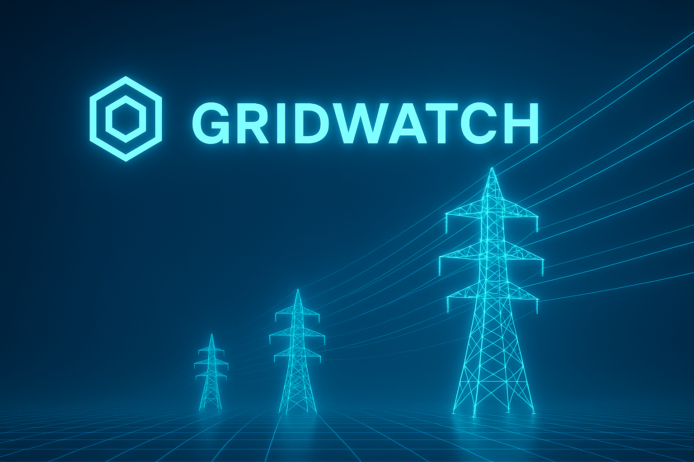

<div style="display: flex; align-items: center; gap: 20px;">
  
  <div>
    <h1>European Energy Grid Stress Prediction</h1>
    <p>A comprehensive machine learning project for predicting electricity grid stress across Europe by integrating weather data, electricity load and generation, load forecasts, and cross-border flows.</p>
  </div>
</div>

## 🎯 Project Objective

Develop a predictive Machine learning model to classify grid stress levels based on historic and real-time data from 13 European countries. This enables grid operators to anticipate stability issues and take preventive measures.

## 📊 Project Workflow

flowchart TD
    A[📥 Raw Data Sources<br>Weather · Generation · Load · Flows · Forecasts] --> B[🧹 data_processing/<br>Aggregation · Integration · Feature Engineering · Imputation · Splits<br>✓ Clean datasets]
    B --> C[🤖 models/<br>Training · Tuning · Evaluation · Selection<br>✓ Trained models & predictions]
    C --> D[📊 streamlit/<br>Visualization · Interpretation · Live Grid-Stress Dashboard]

## 📁 Repository Structure

```
european-energy-grid/
├── README.md                          # This file
├── data_processing/                   # Data pipeline stage
│   ├── README.md                      # Detailed data pipeline docs
│   ├── 01_weather_data_processing.py
│   ├── 02_generation_data_processing.py
│   ├── 03_all_tables_processing.py
│   ├── 04_define_target_variable.py
│   ├── 05_train_val_test_split.py
│   ├── 06a_filling_nans_train.py
│   ├── 06b_filling_nans_validation.py
│   └── 06c_filling_nans_test.py
│
├── models/                            # Model training & evaluation
│   ├── README.md                      # Model documentation
│   ├── grid_stress_classification_models.py
│   ├── grid_stress_regression_models.py
│   ├── grid_stress_regression_classification_models_together.py
│   └── time_series/TS_ARIMA_13_COUNTRIES.py
│
└── streamlit_dashboard/               # Interactive Streamlit Dashboard
│   ├── README.md                      # Dashboard documentation
│   ├── app.py                         # Main Streamlit application
│   ├── requirements.txt               # Python dependencies
│   ├── xgboost_model.pkl              # Trained XGBoost model
│   ├── feature_names.pkl              # Model feature names
│   ├── country_stats.csv              # Country baseline statistics
│   └── arima_models/                  # ARIMA models for forecasting
│       ├── ARIMA_AT.pkl
│       ├── ARIMA_DE.pkl
│       └── ... (11 more country models)
│
└── images/                            # Documentation images
    ├── gridwatch_background.png
    └── ... (other project images)
```

## 🚀 Quick Start

### Prerequisites

- **Databricks** workspace with Apache Spark
- **Python 3.8+** with PySpark
- **Libraries**: pyspark, pandas, scikit-learn, matplotlib, seaborn
- Access to the raw data: `curlybyte_solutions_rawdata_europe_grid_load` database

### Installation

1. Clone this repository
2. Import notebooks into your Databricks workspace
3. Install required libraries (if not already in cluster). The file requirements.txt can be used as base environment:
   ```
   %pip install reverse_geocode scikit-learn matplotlib seaborn
   ```

### Running the Pipeline

**Step 1: Data Processing**
```
Navigate to data_processing/ and run notebooks in order (01 → 06c)
See data_processing/README.md for detailed instructions, as well as a description of the data processing automation to get live data.
```

**Step 2: Model Development**
```
Navigate to models/ and run training notebooks
See models/README.md for model architecture and tuning details
```

**Step 3: Streamlit Dashboard**
```
Navigate to streamlit_dashboard/ for interactive visualization and real-time predictions
See streamlit_dashboard/README.md for setup and usage details.
```

## 📚 Documentation

Each folder has its own detailed README:

- **[data_processing/README.md](./data_processing/README.md)** - Complete pipeline documentation
  - Data sources and transformations
  - Feature engineering details
  - Target variable definition (grid stress score)
  - Imputation methodology
  
- **[models/README.md](./models/README.md)** - Model development documentation
  - Model architectures
  - Hyperparameter tuning results
  - Performance metrics & comparisons
  - Best model selection criteria

- **[streamlit_dashboard/README.md](./streamlit_dashboard/README.md)** - Analysis and results
  - Interactive visualization features
  - Real-time and simulated prediction modes
  - 6-hour forecasting with ARIMA
  - EU heatmap and stress analysis
  - Usage guide and scenario presets

## 🎯 Key Metrics & Target Variable

**Grid Stress Score** (0-100 points):

The target combines three indicators to measure grid stability:

1. **Reserve Margin** (0-25 pts): Current load vs. 24h historical average
2. **Load Forecast Error** (0-25 pts): Prediction accuracy of demand
3. **Cross-Border Flows** (0-50 pts): Unusual import/export levels

**Stress Levels**:
- 🟢 **LOW** (< 33): Grid is stable
- 🟡 **MEDIUM** (33-66): Grid under moderate stress
- 🔴 **HIGH** (> 66): Grid under significant stress

## 🌍 Coverage

**13 European Countries:**
🇦🇹 Austria (AT), 🇧🇪 Belgium (BE), 🇧🇬 Bulgaria (BG), 🇨🇭 Switzerland (CH), 🇩🇪 Germany (DE), 🇩🇰 Denmark (DK), 🇪🇪 Estonia (EE), 🇪🇸 Spain (ES), 🇫🇮 Finland (FI), 🇫🇷 France (FR), 🇬🇷 Greece (GR), 🇭🇷 Croatia (HR), 🇭🇺 Hungary (HU), 🇮🇹 Italy (IT), 🇱🇹 Lithuania (LT), 🇱🇻 Latvia (LV), 🇳🇱 Netherlands (NL), 🇳🇴 Norway (NO), 🇵🇱 Poland (PL), 🇵🇹 Portugal (PT), 🇷🇴 Romania (RO), 🇸🇪 Sweden (SE), 🇸🇰 Slovakia (SK)

## 📊 Data Sources

This project combines two major data sources to create a comprehensive view of the European electricity grid:
1. **ENTSO-E Transparency Platform**
The European Network of Transmission System Operators for Electricity (ENTSO-E) provides real-time and day-ahead operational data:

- **Electricity Load** - Actual and forecasted demand per country (15-minute → hourly aggregation)
- **Generation by Source** - Production by fuel type (nuclear, gas, coal, wind, solar, hydro, etc.) per country
- **Physical Cross-Border Flows** - Electricity flows between neighboring countries, showing net imports/exports
- **Generation Forecasts** - Day-ahead predictions for wind and solar generation

What it tells us: How much power is being produced, where it comes from, and how it moves across countries.

2. **Copernicus Reanalysis Data for model training and OpenMeteo for live data**
High-resolution meteorological data affecting renewable energy production and grid stability:

- **Wind Speed** - Critical for wind generation forecasting
- **Air Temperature** - Drives heating/cooling load and affects transmission line capacity
- **Wind Direction** - Complements wind speed for generation potential
- **Solar Radiation** - Direct influence on photovoltaic output

What it tells us: Weather conditions that directly affect renewable production and therefore grid stability.

## 🛠 Technologies & Stack

- **Platform**: Databricks
- **Processing**: Apache Spark (PySpark)
- **ML Frameworks**: Scikit-learn
- **Data Processing**: Pandas, PySpark, SQL
- **Visualization**: Matplotlib, Seaborn
- **Language**: Python

## 📈 Expected Outputs

### From Data Processing
- `train_set_imputed` - Training data (features + target)
- `validation_set_imputed` - Validation data
- `test_set_imputed` - Test data

### From Models
- Trained regression models (grid stress score)
- Trained classification models (LOW/HIGH stress)
- Trained time series model (ARIMA)
- Performance metrics (Accuracy, F1, Precision, Recall)
- Feature importance rankings
- Predictions on test set

### Streamlit Dashboard
- Interactive dashboard with grid stress prediction

## 🔄 Data Flow Summary

```
Raw Data → Processing → Feature Engineering → Model Training → Evaluation → Results
  ↓           ↓                ↓                   ↓               ↓           ↓
7 sources  Normalize       Weather +          Classification   Metrics &     Dashboards
           Aggregate      Generation            Regression      Insights      & Reports
                         Load + Flows             ARIMA
                          Forecasts          
```

## 📝 Notes

- All notebooks are designed to run in Databricks environment
- Data is aggregated to hourly intervals for consistency
- Countries with incomplete generation data are excluded (14 countries)
- Missing values are imputed using method-specific optimizations per column
- Temporal train/val/test split preserves time-series nature of data
- Reserve margin uses 24-hour rolling windows per country

**Last Updated**: December 2025  