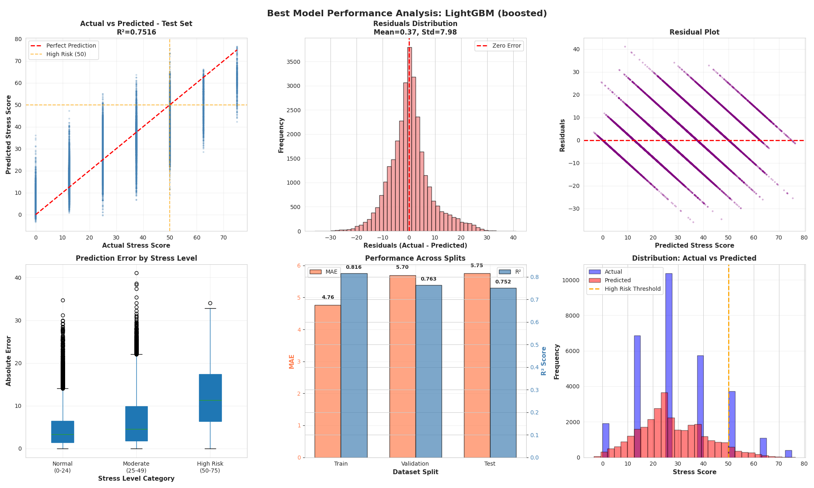
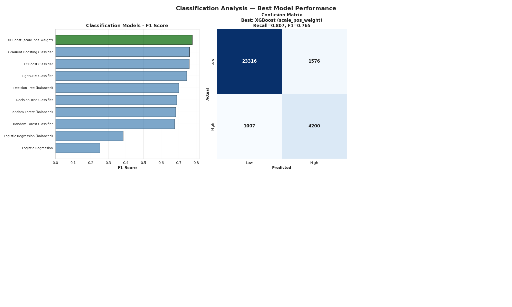

# EU Grid Stress Prediction System

A comprehensive machine learning system for predicting power grid stress levels across 13 European countries, combining regression, classification, and time series forecasting approaches.

---

## Table of Contents

- [Overview](#overview)
- [Requirements](#requirements)
- [Installation](#installation)
- [Notebooks Overview](#notebooks-overview)
- [Data](#data)
- [Models](#models)
- [Results](#results)

---

## Overview

This project predicts grid stress scores (0-100) for European power grids using legitimate operational features. The system helps operators anticipate blackout risks and optimize grid management.

**Key Features:**
- **Regression Models**: Predict continuous stress scores
- **Classification Models**: Binary blackout risk prediction (High Risk vs. Low Risk)
- **Time Series Models**: ARIMA forecasting for 6-hour ahead predictions
- **13 European Countries**: DE, FR, IT, ES, PL, NL, BE, CZ, AT, RO, PT, GR, HU
- **No Data Leakage**: Production-ready features only

**Grid Stress Score Categories:**
- 0-24: Normal operations 
- 25-49: Moderate stress 
- 50-74: High stress (blackout risk) 
- 75-100: Critical 

---

## Requirements

### Python Version
- Python 3.8 or higher

### Core Dependencies
```txt
# Data Processing
pandas>=1.5.0
numpy>=1.23.0

# Machine Learning
scikit-learn>=1.2.0
xgboost==2.0.3
lightgbm==4.1.0

# Time Series
pmdarima>=2.0.0
statsmodels>=0.14.0

# Visualization
matplotlib>=3.6.0
seaborn>=0.12.0

# Big Data (for Databricks)
pyspark>=3.3.0

# Utilities
pickle-mixin>=1.0.2
```

### Optional Dependencies
```txt
# Jupyter Notebooks
jupyter>=1.0.0
ipykernel>=6.19.0

# Progress Bars
tqdm>=4.64.0
```

---

## Installation


### 1. Create Virtual Environment
```bash
# Using venv
python -m venv venv
source venv/bin/activate  # On Windows: venv\Scripts\activate
```

### 2. Install Dependencies
```bash
pip install -r requirements.txt
```

### 3. Databricks Setup

```bash
# Install Databricks CLI
pip install databricks-cli

# Configure
databricks configure --token
```

---

## Notebooks Overview

### 1. `TS_ARIMA_13_countries.ipynb`
**Purpose**: Time series forecasting using ARIMA models

**What it does:**
- Fits individual ARIMA model per country
- 6-hour ahead forecasts
- Validation with MAE and RMSE
- Saves trained models as `.pkl` files

**Output:**
- 13 ARIMA models (one per country)
- Forecast accuracy metrics
- Model files: `arima_models/arima_{country}.pkl`

**Run time:** ~45-60 minutes

---

### 2. `grid_stress_regression_classification_models_together.py`
**Purpose**: Comprehensive analysis combining both regression and classification approaches

**What it does:**
- Loads data from Databricks tables
- Feature engineering (temporal, lag, rolling statistics)
- Trains 15 regression models (Linear, Tree-based, Ensemble)
- Trains 10 classification models
- Threshold optimization
- Complete EDA with visualizations

**Output:**
- Best regression model (LightGBM)
- Best classification model (XGBoost)
- Feature importance analysis
- Performance metrics (MAE, RMSE, R², F1, Recall)

**Run time:** ~120-180 minutes

---

### 3. `grid_stress_classification_models.py`
**Purpose**: Dedicated classification for blackout prediction

**What it does:**
- Binary classification (Blackout Risk: Yes/No)
- Trains 10 classification algorithms
- Class balancing with weights
- Confusion matrix analysis
- Business impact assessment

**Output:**
- Best classifier: XGBoost (scale_pos_weight)
- Confusion matrix visualizations
- Classification metrics (Accuracy, Precision, Recall, F1)
- Saved model: `grid_stress_classification/xgboost_model.pkl`

**Run time:** ~20-30 minutes

---

### `grid_stress_regression_models.py`
**Purpose**: Regression-based stress score prediction

**What it does:**
- Trains 15 regression models
- Hyperparameter tuning for LightGBM
- Threshold optimization for binary classification
- Feature importance analysis
- Overfitting detection

**Output:**
- Best regressor: LightGBM (boosted)
- Optimal threshold: 50 (adjustable)
- Regression metrics (MAE, RMSE, R²)
- Saved model: `regression_models/regression_model_outputs.pkl`

**Run time:** ~120-180 minutes

---

## Data

### Dataset Structure

- **Train:**      386,525 records (2023-2024)
- **Validation:** 111,670 records (Jan-Jun 2025)
- **Test:**        53,599 records (Jul-Nov 2025)


### Features Used

**Legitimate Features (No Leakage):**
- **Load Data**: Actual_Load, Forecasted_Load, load lags (1h, 24h)
- **Weather**: mean_temperature_c, mean_wind_speed, mean_ssrd
- **Temporal**: Hour, day of week, month (cyclical encoding)
- **Derived**: Rolling statistics, load-forecast differences
- **Country**: One-hot encoded (13 countries)

**Excluded Features (Data Leakage):**
- `net_imports` (used in T7/T8 target calculation)
- `stress_lag_*` (target to predict target)
- `reserve_margin_ml`, `forecast_load_error` (target components)

---

## Models

### Regression Models
The regression task predicts continuous grid stress scores (0–100).  
The best-performing model is LightGBM.



**Key Results (Test Set):**
- **R²:** ~0.75  
- **MAE:** ~5.7  
- **Residual Std:** ~8.0  

These results show that the model captures the overall stress patterns well, with reasonable error levels across all splits.


### Classification Models
We also trained machine learning classifiers to directly predict whether the grid is in a high-risk state (binary classification).  
The best model is **XGBoost (scale_pos_weight)**.



**Performance:**
- **Recall:** ~0.807  
- **F1-Score:** ~0.765  

This model provides a balanced trade-off between detecting high-risk events and avoiding false alarms.


### Time Series Models (13 ARIMA)
- One ARIMA model per country
- **Average MAE:** ~3.5 points
- **Average RMSE:** ~4.8 points

---

## Results

### Regression Performance (Test Set)
The regression model predicts continuous stress scores from 0 to 100.  
Performance values below come from the test set.

**Key Metrics:**
- **R²:** ~0.75  
- **MAE:** ~5.7  
- **Residual Std:** ~8.0  

These results indicate that the model captures overall stress level patterns well, with reasonable prediction error across the full range of grid stress values.

### Classification Performance (Test Set)
#### Best Model: XGBoost (scale_pos_weight)
- **Accuracy**: 87.7%
- **Precision**: 91.4% 
- **Recall**: 80.7% 
- **F1-Score**: 0.765

**Performance Summary**: This model provides a strong balance between detecting true high-risk events and keeping false alarms low.


---

## Acknowledgments

- European power grid operators for data
- Databricks for compute infrastructure

---

## Related Resources

- [Scikit-learn Documentation](https://scikit-learn.org/)
- [XGBoost Documentation](https://xgboost.readthedocs.io/)
- [LightGBM Documentation](https://lightgbm.readthedocs.io/)
- [ARIMA/pmdarima Documentation](http://alkaline-ml.com/pmdarima/)
- [Databricks Documentation](https://docs.databricks.com/)

---

